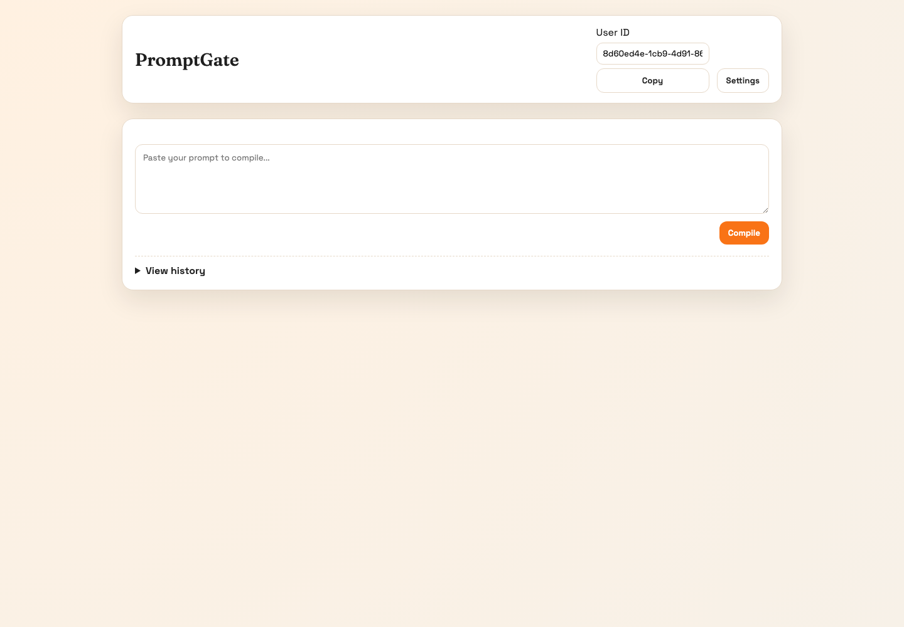
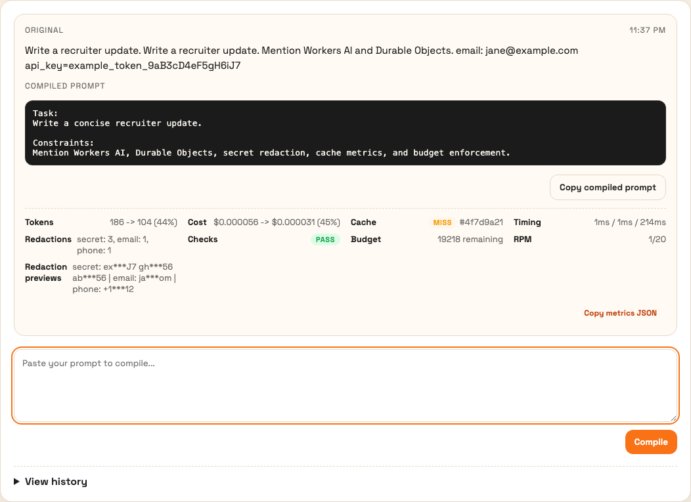

# PromptGate

PromptGate is a Cloudflare Workers and Durable Objects prompt gateway. It redacts secrets before AI calls, compiles noisy prompts with Workers AI, validates important constraints, enforces per-user budgets and rate limits, caches safe compiled prompts, and returns a metrics report for every request.

## Why this exists

LLM apps often send raw user prompts directly to inference. PromptGate puts a small infrastructure layer in front of that path:

1. redact secrets and PII deterministically;
2. normalize duplicate prompt content;
3. call Workers AI only with sanitized text;
4. verify constraints and semantic preservation;
5. cache compiled prompts by sanitized prompt hash;
6. track usage, budget, cache, timing, and redaction metrics.

## Screenshots





## Architecture

- Pages-style static UI in `public/`
- Worker router in `src/worker.ts`
- Per-user Durable Object in `src/durable/UserStateDO.ts`
- Testable compile pipeline in `src/lib/compilePipeline.ts`
- Deterministic redaction, normalization, constraint checking, token/cost reporting, and LLM wrappers in `src/lib/`

See [docs/ARCHITECTURE.md](docs/ARCHITECTURE.md) for request flow, state layout, and cache behavior.

## Current benchmark results

Generated with `npm run bench` using a deterministic mocked-AI corpus. The benchmark fails if raw synthetic secrets reach the mocked AI payload.

| Metric | Value |
| --- | ---: |
| Corpus cases | 5 |
| Requests | 10 |
| Failed requests | 0 |
| Average token reduction | 33% |
| p95 cache-hit latency | 0.75 ms |
| p95 miss latency | 4 ms |
| AI calls avoided by cache | 10 |
| Raw secret leaks to AI | 0 |
| Requests with redactions | 4 |

Full output: [benchmarks/results/latest.json](benchmarks/results/latest.json)

## Quickstart

```bash
npm install
npm run check
npm run bench
npm run dev
```

Deploy:

```bash
npm run deploy
```

Generate screenshots:

```bash
npx playwright install chromium
npm run screenshots
```

## Tests

```bash
npm run typecheck
npm run test
npm run test:worker
npm run check
```

Current local result:

- TypeScript: passing
- Vitest helper/pipeline/DO/UI-source tests: 19 passing
- Cloudflare Workers Vitest smoke tests: 2 passing
- Total: 21 passing tests

Coverage includes redaction patterns, normalization, token/cost reports, constraint validation, LLM JSON parsing, raw-secret egress prevention, cache hits, quota failures, AI fallback, post-LLM redaction, Durable Object bearer-secret binding, CORS preflight, and missing-user validation.

## API overview

All API calls require a `userId` and `Authorization: Bearer <clientSecret>`.

- `POST /api/compile`
- `GET /api/state?userId=<id>`
- `POST /api/state`
- `GET /api/history?userId=<id>`
- `POST /api/clear-history`

The first valid bearer secret seen by a user's Durable Object is hashed and bound to that user. Later requests with a different secret return `403`.

## Security model

PromptGate is a best-effort prompt gateway, not a complete DLP product. It protects common accidental leakage paths by redacting known secret and PII patterns before LLM calls and re-redacting model output before storage. It does not guarantee removal of every possible secret format.

See [SECURITY.md](SECURITY.md) for the threat model and limitations.

## Resume bullets supported by this repo

- Built PromptGate, a Cloudflare Workers/Durable Objects AI gateway that redacts secrets before inference, compiles prompts with Workers AI, and enforces per-user budgets, rate limits, TTL caching, and redacted history.
- Added test and benchmark suite covering 5 synthetic prompt classes, quota enforcement, cache behavior, LLM fallback paths, and raw-secret egress prevention; measured 33% average token reduction and 0.75 ms p95 cached compile latency with mocked AI.

## Limitations

- Token estimates use a simple `chars / 4` heuristic.
- Pattern redaction is best-effort and should not be treated as complete data-loss prevention.
- Benchmarks are deterministic mocked-AI results unless `bench:live` is explicitly run with valid Cloudflare credentials.
- The built-in bearer secret is lightweight per-user access control, not a full account system.
